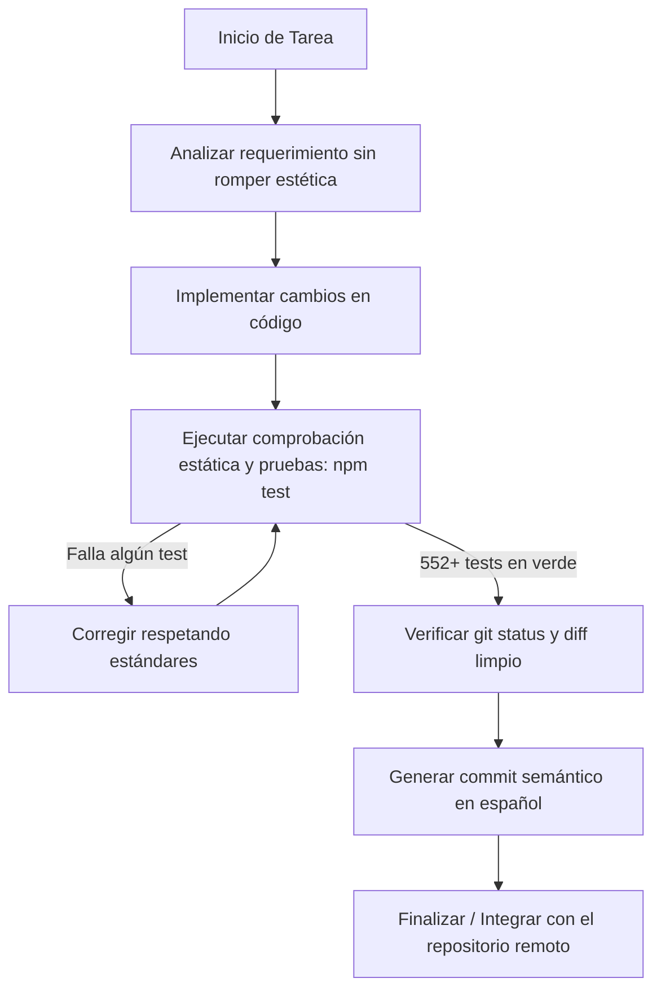

# Guía y Estándares para Agentes de IA — Miniápolis

> **Propósito:** Este documento es la referencia definitiva y de lectura obligatoria para cualquier agente autónomo o asistente de IA (Claude, Gemini, Cursor, Copilot, Antigravity, Codex o similar) que vaya a analizar, proponer o aplicar cambios en este repositorio.
> 
> **Objetivo primordial:** Mantener la coherencia arquitectónica, garantizar que la suite de pruebas pase al 100% y salvaguardar con absoluta fidelidad la identidad visual y estética **«Pit Lane Editorial / Puesto de Telemetría»**.

---

## 1. Principios Fundamentales y Reglas de Oro

1. **No alterar la estética visual ni el lenguaje de marca existente:**
   - La identidad visual es intencional, madura y rigurosamente coherente. Todo nuevo componente, pantalla o ajuste visual debe respetar milimétricamente la paleta, las tipografías variables, los radios, los filos y el ritmo ya establecidos.
   - Si una tarea solicita cambios funcionales o de backend, **no toques los estilos ni el maquetado visual existente**.

2. **Cero estilos en línea (`style="..."`):**
   - El proyecto cuenta con una estricta Política de Seguridad de Contenido (CSP).
   - El uso del atributo `style` en HTML está **terminantemente prohibido** y es verificado por la suite automatizada (`tests/frontend.test.js`). Todo estilo debe residir en las hojas CSS correspondientes (`public/css/`).

3. **Sin frameworks ni empaquetadores en el frontend:**
   - No añadir React, Vue, Tailwind, Webpack, Vite ni dependencias pesadas de NPM para la interfaz del navegador.
   - El frontend corre en HTML5 semántico, CSS3 moderno con variables y Vanilla JavaScript estructurado con **ES Modules nativos** (`import` / `export`, `type="module"`).

4. **Inmutabilidad de migraciones existentes:**
   - El esquema de base de datos (`src/db/migrations.js`) es una lista secuencial inmutable.
   - **NUNCA modifiques ni reordenes una migración ya existente**, ya que rompería las bases en producción. Cualquier cambio de esquema debe añadirse como una **nueva migración al final del arreglo**.

5. **Cumplimiento estricto del validador estático:**
   - La suite de pruebas incluye un analizador estático en `tests/frontend.test.js` que verifica:
     - Que toda clase usada en el HTML exista definida en el CSS.
     - Que todo `#identificador` buscado por JavaScript (`$('#id')`) exista en el HTML o se genere dinámicamente en el módulo correspondiente.
     - Que toda función importada desde `ui.js` o entre módulos de `public/js/` exista y esté correctamente exportada e importada.
     - Que los atributos de accesibilidad (`aria-controls`, `aria-labelledby`, `aria-describedby`, `<label for>`) apunten a IDs reales.
     - Que todas las pantallas lleven el meta `<meta name="theme-color" content="#000000">` y carguen `styles.css`.

6. **Obligatoriedad de pasar `npm test` antes de cualquier entrega:**
   - Toda intervención debe dejar la suite de pruebas completa en verde (`552+ tests pasados, 0 fallos`).

---

## 2. Sistema de Diseño: «Pit Lane Editorial / Puesto de Telemetría»

La interfaz emula un puesto de telemetría de competición de alta precisión: los datos mandan, las líneas son finas, las tipografías transmiten espíritu de carrera y el color verde de acento solo interviene cuando algo de verdad importa.

### 2.1. Paleta de Colores y Tokens Oficiales

Usa **únicamente** las variables CSS globales definidas en `public/css/styles.css` y `public/css/publico.css`. Nunca introduzcas colores hexadecimales aleatorios ni grises desalineados.

| Propósito | Variable CSS | Valor Hex / RGBA | Uso |
|---|---|---|---|
| **Lienzo absoluto** | `--fondo` | `#000000` | Fondo negro base de toda la web |
| **Lienzo secundario** | `--fondo-2` | `#080b0c` (o `#0b0c0d`) | Huecos, pistas de barras y fondos hundidos |
| **Superficie** | `--superficie` | `#0d1214` (o `#0e1011`) | Tarjetas, paneles e instrumentos |
| **Superficie elevada** | `--superficie-2` | `#151c1e` (o `#16191b`) | Cierres, hovers de botón y pies de modal |
| **Línea sutil** | `--borde` / `--pub-linea` | `rgba(226, 240, 231, .12)` / `rgba(255,255,255,.08)` | Separadores y contornos principales (1px) |
| **Línea media** | `--borde-fuerte` / `--pub-linea-2` | `rgba(226, 240, 231, .28)` / `rgba(255,255,255,.16)` | Bordes activos y divisiones de sección |
| **Borde de campo** | `--borde-campo` | `rgba(226, 240, 231, .4)` / `#5e6469` | Contorno de inputs (cumple 3:1 de accesibilidad) |
| **Texto principal** | `--texto` | `#f3f7f4` (o `#f4f6f3`) | Títulos y texto de alta visibilidad |
| **Texto secundario** | `--texto-2` | `#b7c4bc` (o `#b4babd`) | Párrafos y descripciones |
| **Texto atenuado** | `--texto-3` | `#7e8d84` (o `#8b9296`) | Rótulos de apoyo y metadatos (5,4:1 contraste) |
| **Acento de marca** | `--acento` / `--ok` | `#93d241` | Verde oficial (contraste 12:1 sobre negro) |
| **Acento suave** | `--acento-suave` | `rgba(147, 210, 65, .1)` | Rellenos sutiles de estado activo |
| **Borde de acento** | `--acento-borde` | `rgba(147, 210, 65, .42)` | Resaltados y bordes de éxito |
| **Texto sobre verde** | `--sobre-acento` | `#041006` (o `#05090a`) | Texto sobre fondo verde macizo |
| **Alerta** | `--alerta` | `#ffd166` (o `#ffc53d`) | Avisos y estados de advertencia |
| **Alerta suave** | `--alerta-suave` | `rgba(255, 209, 102, .1)` | Fondos de advertencia |
| **Error / Peligro** | `--error` | `#ff746d` (o `#ff6f68`) | Errores y acciones destructivas |
| **Error suave** | `--error-suave` | `rgba(255, 116, 109, .1)` | Fondos de error |

### 2.2. Tipografía y Jerarquía

El sitio utiliza tipografías variables locales (sin conexión externa):

1. **`--display: 'Saira', 'Sora', sans-serif`**:
   - **Voz de pista y competición:** Se abre a lo ancho con el eje variable `font-stretch: 110% - 125%`.
   - **Dónde se usa:** Titulares (`h1`, `h2`), cifras de telemetría, cronómetros, botones en mayúsculas y rótulos de sección.
2. **`--fuente: 'Sora', system-ui, sans-serif`**:
   - **Voz de lectura:** Geométrica, legible y cómoda para textos largos, párrafos, modales y tablas.
3. **`--mono: ui-monospace, Menlo, Consolas, monospace`**:
   - **Voz técnica:** Códigos de pack (`RHE-XXXX-XXXX`), cifras de fecha/hora, contadores numéricos con `font-variant-numeric: tabular-nums`.
4. **Rótulo Micro (`.micro`, `.seccion-marca`, `thead th`, `.campo > label`)**:
   - Tipografía en versalitas/mayúsculas con tracking amplio (`letter-spacing: .12em` a `.2em`), tamaño contenido (`clamp(.68rem, .75rem)`) y peso `600-650`. Nombra el dato sin competir con él.

### 2.3. Formas, Bordes y Superficies

- **Filos de un píxel:** La separación entre elementos se logra mediante líneas de 1px finas y luz de filo (`--filo: inset 0 1px 0 rgba(255,255,255,.055), inset 0 -1px 0 rgba(0,0,0,.45)`), nunca con falsos biseles.
- **Radios:**
  - Paneles y tarjetas generales: `--radio` (12px - 16px).
  - Botones e inputs: `--radio-s` (9px - 11px).
  - Pastillas micro / badges: `--radio-micro` (5px) o `--radio-xs` (6px).
  - En el área pública y de cronometraje: estilo más austero y mecanizado (`--pub-radio: 6px`).
- **Sombras:**
  - Sobre negro profundo, una sombra común se pierde. Las sombras se reservan para elementos flotantes reales como diálogos modales (`--sombra-alta`) y notificaciones flotantes (`.brindis`).
- **Tratamiento fotográfico:**
  - Las imágenes se muestran limpias, con esquinas definidas y borde fino de 1px.
  - **Nunca colocar texto sobre una foto** salvo en la apertura (`.hero`), la cual lleva un velo oscuro graduado de dos vías (horizontal y vertical) que garantiza el contraste absoluto de lectura.

### 2.4. Microinteracciones y Movimiento

- **Curvas de aceleración unificadas:**
  - `--curva: cubic-bezier(0.22, 1, 0.36, 1)`
  - `--curva-hover: cubic-bezier(0.16, 1, 0.3, 1)`
  - `--pub-curva: cubic-bezier(0.16, 1, 0.3, 1)`
- **Tiempos de animación:**
  - `--t-rapida: 140ms`
  - `--t-hover: 220ms`
  - `--t-media: 260ms`
  - `--t-lenta: 460ms`
- **Efectos de interacción:**
  - **Botón principal (`.boton--principal`):** Incluye un sutil barrido de luz de velocidad constante (`filoBarrido`, 620ms linear) al pasar el cursor. Al presionar se hunde 1px (`translateY(1px)`).
  - **Punto en vivo (`.punto--vivo`):** Pulso de radar periódico (2.5s) que anuncia conexión activa.
  - **Pestañas:** Subrayado viajero que se traza suavemente al cambiar de vista.
- **Movimiento reducido:**
  - Todo estilo que contenga transiciones o animaciones debe respetar `@media (prefers-reduced-motion: reduce)`.
  - El JavaScript nunca debe ocultar contenido de forma permanente si las animaciones están apagadas o si falla GSAP.

---

## 3. Estándares de Código y Arquitectura

### 3.1. Frontend (`public/`)

- **Estructura modular:**
  - `public/js/shell.js`: Inicialización de interfaz y accesibilidad global.
  - `public/js/ui.js`: Librería de utilidades para DOM, formateo, iconos, brindis, diálogos y modales.
  - `public/js/api.js`: Cliente HTTP centralizado con manejo de tokens, CSRF y rotación de sesión.
  - `public/js/realtime.js`: Cliente SSE para sincronización en tiempo real.
  - Módulos específicos por pantalla: `cliente.js`, `admin.js`, `escaner.js`, `portada.js`, `ficha.js`, `avisos.js`, `fidelidad.js`.
- **Manipulación de DOM:**
  - Emplear las funciones auxiliares de `ui.js`: `$` (querySelector), `$$` (querySelectorAll), `el(tag, attrs, ...children)`, `limpiar(el)`.
  - **Sanitización:** Todo contenido dinámico proveniente del usuario o de la base debe escaparse o insertarse como nodo de texto (`textContent`). Nunca usar `innerHTML` con datos sin sanear.
- **Responsividad:**
  - Todas las pantallas deben diseñarse mobile-first o fluidas utilizando `clamp()`, `minmax()` en CSS Grid y Flexbox.
  - Probar que los titulares largos no desborden ni fuercen scroll horizontal en anchos pequeños (320px - 375px).

### 3.2. Backend (`src/`)

- **Patrón de capas:**
  - `src/routes/`: Declaración de endpoints HTTP Express y validaciones de entrada.
  - `src/services/`: Lógica de negocio pura (saldo, packs, auditoría, fidelidad, carteras, 2FA).
  - `src/db/`: Conexión SQLite y migraciones (`migrations.js`).
  - `src/lib/`: Utilidades criptográficas, generador de QR, tokens JWT, fechas y cálculos.
  - `src/middleware/`: Manejo de autenticación, control de acceso por rol (`rolRequerido`), rate limiting y seguridad HTTP.
- **Manejo de Base de Datos:**
  - Motor: SQLite mediante `better-sqlite3`.
  - Toda operación crítica que altere saldos o consumos debe ejecutarse dentro de una **transacción atómica** (`db.transaction(...)`).
  - Seguir el patrón contable de libro mayor: los consumos y recargas se auditan con fecha, hora, usuario e identificadores unívocos.
- **Seguridad:**
  - Headers HTTP seguros vía Helmet / middleware de seguridad propio.
  - Verificación estricta de `Origin` y `SameSite=Strict` para prevenir CSRF.
  - Contraseñas hasheadas con algoritmos modernos y resistentes a ataques de fuerza bruta.
  - Rutas de administración protegidas por rol estricto y factor de autenticación adicional cuando corresponda.

---

## 4. Flujo de Trabajo y Verificación para Agentes

Antes de proponer o finalizar cualquier cambio en este repositorio, el agente debe seguir obligatoriamente este checklist:

### Checklist Pre-Finalización:
- [ ] ¿Se respetó al 100% la estética existente sin introducir colores, sombras ni estilos ajenos?
- [ ] ¿Se evitó el atributo `style="..."` en todo archivo HTML?
- [ ] ¿Toda nueva clase CSS está definida y toda referencia a ID en JS existe?
- [ ] ¿Toda función de `ui.js` usada está explícitamente importada?
- [ ] ¿Se preservaron inmutables las migraciones existentes en `src/db/migrations.js`?
- [ ] ¿Ejecutó `npm test` y todos los tests pasan con 0 fallos?
- [ ] ¿El mensaje de commit describe con precisión el cambio en español?
